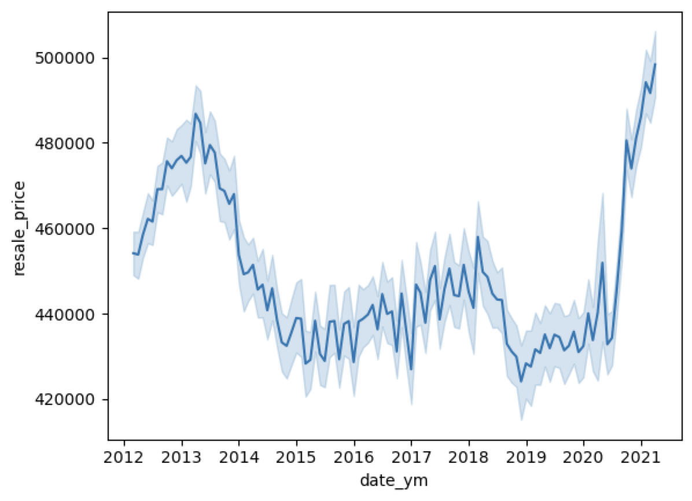
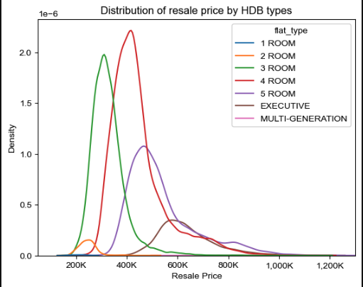
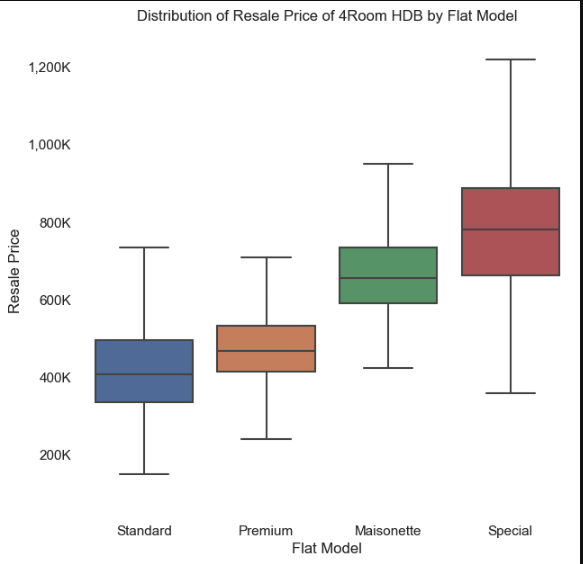
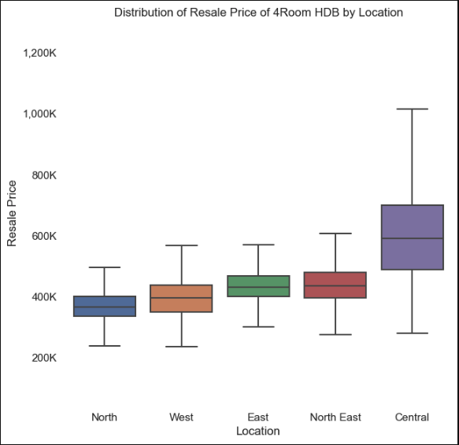
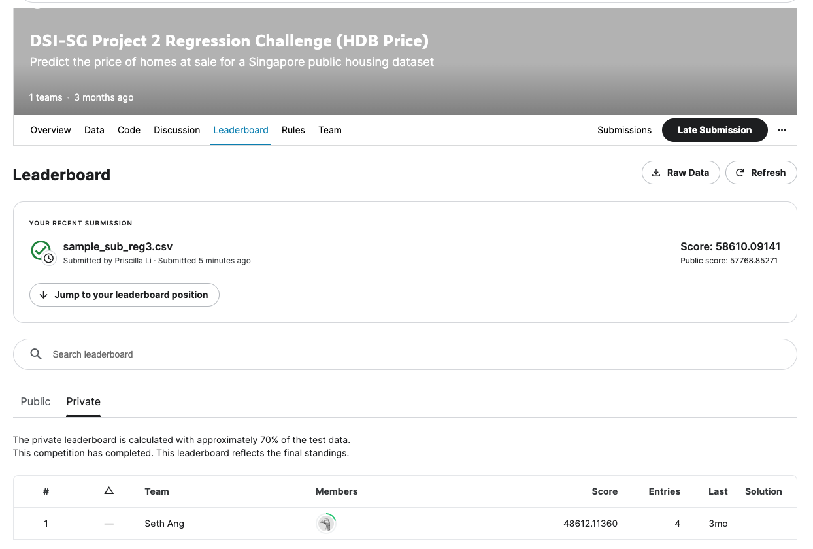

#   Project 2 - Singapore Housing Data and Kaggle Challenge
***
### Project Goals:
#### 1. Identify independent features that can be used to predict dependent variable of HDB resale price
#### 2. Creating and iteratively refining a regression model
#### 3. Using [Kaggle](https://www.kaggle.com/) to assess model
#### 4. Providing business insights through reporting and presentation.

 

### Key Highlights of EDA and feature selection
#### 1. Non-stationarity of HDB resale prices  

 

 

Resale Price of HDBs from 2012 to 2021 have not remained stationary over time: we see that housing prices boomed in 2013, suppressed pricing from 2014-2020, and a significant increase from 2021 onwards surpassing previous high. Therefore resale price is not stationary.

Applying log transformation, the ADF test statics is lesser (more negative) then the critical value, and p-value is less than 0.05. Therefore we can reject null hypothesis. This indicates that the log transformation of resale price makes it stationary.

 

#### 2. Categorical features identified to be correlated to resale price, OHE to fit into linear regression model
<table>
  <tr>
    <td> </td>
    <td> flat type </td>
   </tr> 
    <tr>
    <td> </td>
    <td> flat model  </td>
   </tr> 
    <tr>
    <td> </td>
    <td> region  </td>
   </tr>     
    
</table>

 

#### 3. Residuals of mumerical features have been check for normal distribution for assesment of suitable fit in linear regression model, those with high correlation selected

 

### Model tuning
#### 1. Identify best train-test split ratio
#### 2. Use naive assumption of median HDB price as base model
#### 3. Iterative process of identifying best optimal within each Ridge, Lasso and ElasticNet regression model, and between models 
#### 4. Ridge model identified to produce best result with highest r squared of 83.9% explanatory power
</td> 

</td> 
Ridge regression penalize coefficients that have less predictive ability to dependent variable, shrinking them.

|Variable                   | Coefficient|
|----------------------------|----------|
tranc_year                   | -0.040971
floor_area_sqm               | 0.174951
mid_storey                   |  0.037392
hdb_age                      | -0.081785
max_floor_lvl                |  0.034194
mall_nearest_distance        | -0.008637
hawker_nearest_distance      | -0.050242
mrt_nearest_distance         | -0.043487
region_East                  | -0.052200
region_North                 | -0.121992
region_North East            | -0.057631
region_West                  | -0.099910
flat_type_2 room             |  0.004073
flat_type_3 room             |  0.095134
flat_type_4 room             |  0.138822
flat_type_5 room             |  0.125771
flat_type_executive          | 0.089073
flat_type_multi-generation   |  0.006161
flat_model_premium           | -0.023450
flat_model_special           |  0.014226
flat_model_standard          | -0.029018

Intercept: 12.968266543349296

Since resale price is the only variable log transformed, interpretation of coefficient is a unit change in independent variable will result in the corresponding percentage change in resale price.

### Future Improvements
- explanatory power of model can be improved through gradient boosting 
- more variables can be introduced (e.g. economic data which affect demand / supply of resale HDBs)